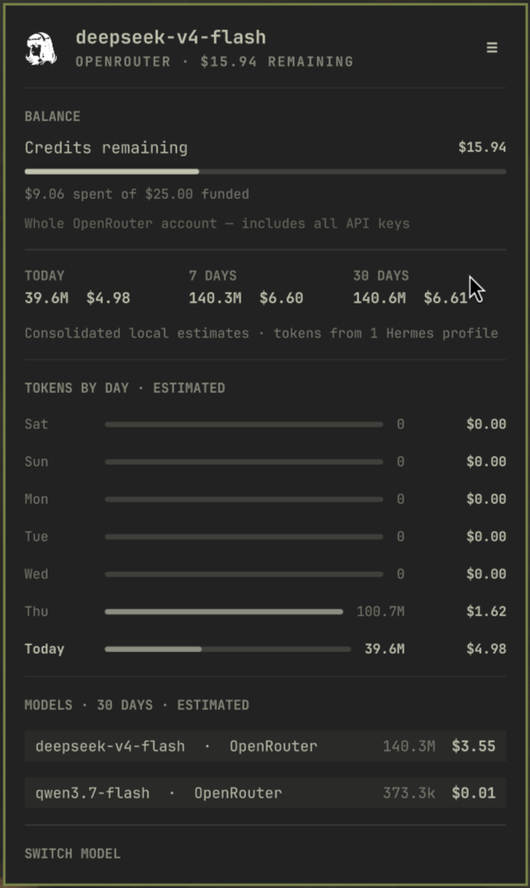
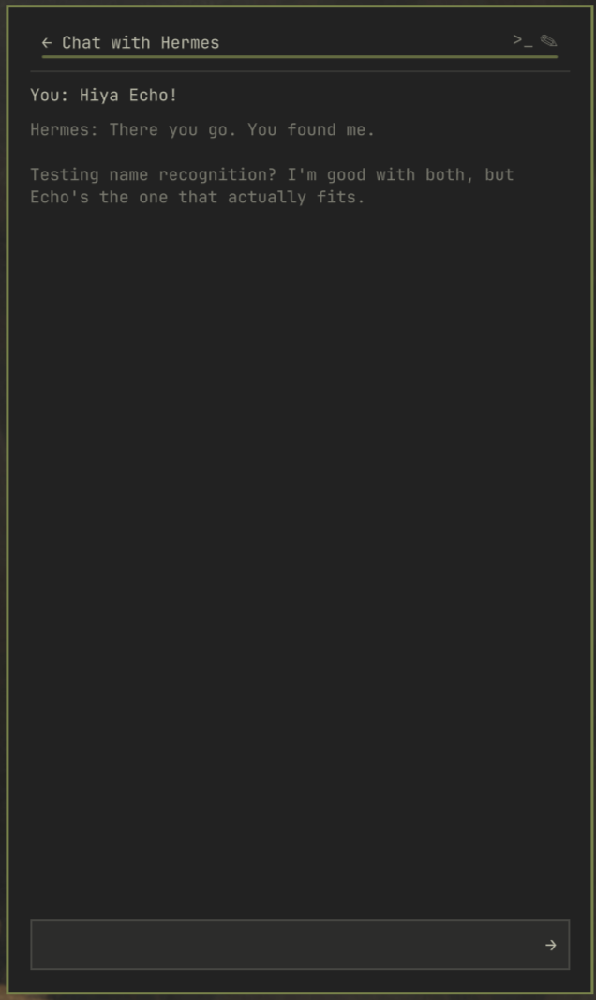
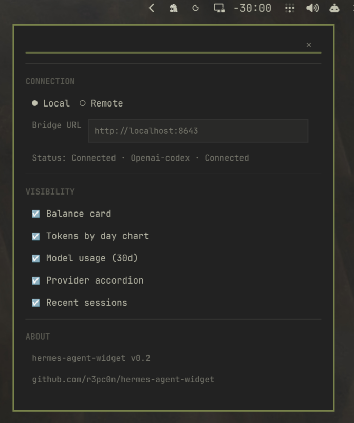
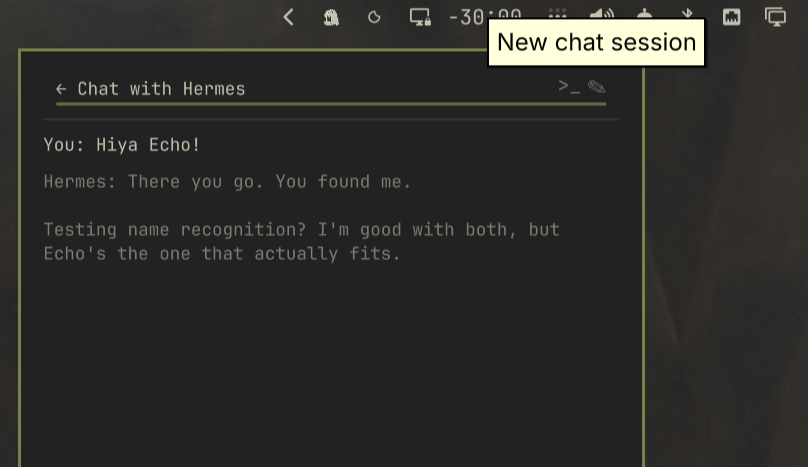
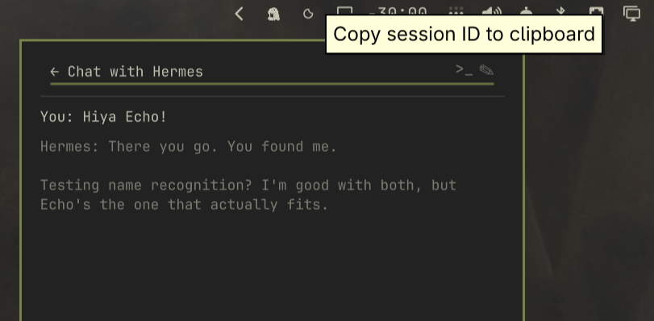

# Hermes Agent — Omarchy Bar Widget

A full-featured [Omarchy](https://omarchy.org/) (Quickshell) bar widget for
[Hermes Agent](https://github.com/NousResearch/hermes-agent), with usage
tracking, provider balances, model switching, and a quick-chat overlay with
terminal session resume.


> This project is based on the original
> [Hermes OpenRouter widget](https://github.com/sradetzky/omarchy-hermes-openrouter).
> This fork adds chat, session management, multi-provider support, and the
> ability to connect to a Hermes Agent running either locally on your Omarchy
> machine or remotely on another computer, server or VPS.

## Requirements

- Omarchy Quattro with the Quickshell-based Omarchy shell.
- Hermes Agent installed for the same user as the widget or Remote bridge.
- Python 3; the bridge uses only the Python standard library.
- For optional Remote mode: a systemd user session and a trusted LAN or VPN.

## Features

### Usage panel

- **Balance:** See remaining credits at a glance with a usage meter. Balance
  tracking works with DeepSeek and OpenRouter API keys, while OAuth and
  subscription providers show their connection status.
- **Usage:** View token totals and estimated costs for today, the last 7 days,
  and the last 30 days, including breakdowns by day and model. The data comes
  directly from Hermes' `state.db`.
- **Model switcher:** Choose from a curated model list grouped by provider.
  Switching sends a request to the bridge, which updates `config.yaml`; new
  sessions use the selected model immediately.

<p align="center">
  
</p>

### Dashboard shortcut

Click the Hermes logo to open the Hermes web dashboard in your browser. This
shortcut requires the dashboard service to be enabled and running on your
Hermes Agent.

- **Local Agent:** The dashboard can remain bound to localhost, using its
  default address of `127.0.0.1:9119`.
- **Remote Agent:** The dashboard must listen on an address reachable from the
  Omarchy machine. Binding it to `0.0.0.0:9119` makes it available through the
  remote machine's LAN or VPN address.

> **Security:** Current Hermes releases require authentication whenever the
> dashboard uses a non-loopback bind such as `0.0.0.0`. Username/password
> authentication is suitable for a trusted LAN or VPN; use OAuth or OIDC for
> an internet-facing deployment. Do not expose port `9119` directly to the
> public internet or try to bypass authentication with `--insecure`. See the
> [Hermes Web Dashboard documentation](https://hermes-agent.nousresearch.com/docs/user-guide/features/web-dashboard).

#### Set up the dashboard with Hermes Agent

Give your Hermes Agent the following prompt after replacing
`<DEPLOYMENT_MODE>` with either `LOCAL` or `REMOTE LAN`:

> Set up the Hermes Web Dashboard on this machine as a persistent service.
> Deployment mode: `<DEPLOYMENT_MODE>`.
>
> First inspect the installed Hermes version and `hermes dashboard --help`, and
> preserve my existing Hermes configuration. Ensure the dashboard dependencies
> are installed using the method supported by this Hermes installation.
>
> - For `LOCAL`, bind the dashboard to `127.0.0.1` on port `9119`.
> - For `REMOTE LAN`, bind it to `0.0.0.0` on port `9119`. Configure a currently
>   supported authentication provider before starting it. Prefer the bundled
>   username/password provider for a trusted LAN or VPN, ask me for any needed
>   choices or credentials, and never use `--insecure` to bypass authentication.
>
> Create a persistent service appropriate for this operating system, using the
> actual Hermes executable path and `--no-open`. Do not overwrite unrelated
> configuration. Enable and start the service, verify that it survives logout
> and reboot, check the listening address and `/api/status`, and report the URL
> I should open. For Remote mode, keep access limited to my trusted LAN or VPN
> and do not expose it directly to the public internet.


### Quick-chat overlay

The chat panel stays in sync with Hermes' session system:

- **Send messages:** Each message is sent through the Hermes CLI.
- **Keep context:** The widget tracks Hermes' `session_id`, keeping the
  conversation continuous across messages.
- **Resume in a terminal (`>_`):** Open `hermes chat --resume <id>` in a real
  terminal to continue the same conversation with the full TUI, tools, and
  history. In Remote mode, the session ID is copied to the clipboard instead.
- **Start a new session (`✎`):** Clear the displayed history and begin with a
  fresh session context.

<p align="center">
  
</p>

### Local and Remote modes

**Local mode** auto-starts the Python bridge on the Omarchy machine and
connects to `localhost:8643`. Use it when Hermes runs on the same machine as
your desktop.

**Remote mode** points the widget to an authenticated bridge on another
machine, such as a server or VPS. Use it for a central Hermes instance serving
one or more clients over a trusted LAN or VPN.

Switch modes in the settings panel. The bridge URL and access-token fields
appear when Remote mode is enabled.

<p align="center">
  
</p>

## Quick install

### Omarchy plugin manager

```bash
omarchy plugin add https://github.com/r3pc0n/hermes-agent-widget.git --enable --yes
omarchy restart shell
```

With `--yes`, the install command uses the widget's default bar section:
`right`. To place it explicitly—or move it later—run one of the following
commands:

```bash
# Left side
omarchy plugin enable io.github.r3pc0n.hermes-agent-widget --section left

# Middle of the bar
omarchy plugin enable io.github.r3pc0n.hermes-agent-widget --section center

# Right side
omarchy plugin enable io.github.r3pc0n.hermes-agent-widget --section right
```

> **Upgrading from a pre-marketplace installation:** The old plugin ID cannot
> be updated in place after the rename. Remove it once with
> `omarchy plugin remove echo.model --yes`, then run the Quick install command
> above. Your Hermes configuration and conversations are not removed.

### Manual install

```bash
git clone https://github.com/r3pc0n/hermes-agent-widget.git
mkdir -p ~/.config/omarchy/plugins/io.github.r3pc0n.hermes-agent-widget
cp hermes-agent-widget/Widget.qml \
   hermes-agent-widget/bridge.py \
   hermes-agent-widget/manifest.json \
   ~/.config/omarchy/plugins/io.github.r3pc0n.hermes-agent-widget/
cp -r hermes-agent-widget/assets/ ~/.config/omarchy/plugins/io.github.r3pc0n.hermes-agent-widget/
omarchy restart shell
```

## Remote mode: bridge setup

If Hermes runs on another machine, install the bridge there:

```bash
git clone https://github.com/r3pc0n/hermes-agent-widget.git
cd hermes-agent-widget
./install-bridge.sh
```

Review `install-bridge.sh` before running it. The installer copies the bridge
from that checkout, generates a private access token, and creates a systemd
user service on port `8643`. The bridge reads `~/.hermes/state.db` and
`~/.hermes/config.yaml` directly and has no Python dependencies outside the
standard library.

Then configure the widget:

1. Left-click the Hermes icon to open the panel.
2. Click the **☰** button to open settings.
3. Enable **Remote**.
4. Enter the bridge URL, for example `http://<server-ip>:8643`.
5. Enter the access token printed by the installer. You can retrieve it later
   from `~/.config/hermes-agent-widget-bridge/env` on the Remote Agent machine.

### Install the bridge with Hermes Agent

You can also give your Hermes agent this prompt:

> Install the Hermes Usage Bridge on this machine so an Omarchy bar widget can
> pull usage data from my agent. Clone and review the repository, then run its
> installer:
>
> ```bash
> git clone https://github.com/r3pc0n/hermes-agent-widget.git
> cd hermes-agent-widget
> ./install-bridge.sh
> ```
>
> Then confirm that the authenticated bridge is running on port 8643 and show
> me the bridge URL and generated access token. Keep the service limited to my
> trusted LAN or VPN.

## Architecture

```text
┌─────────────────────┐     ┌──────────────────────────┐
│ Omarchy bar         │     │ Hermes Agent machine     │
│                     │     │                          │
│ Widget.qml          │     │ bridge.py                │
│ ├─ Usage panel ◄────┼─────┤ ├─ GET  /hermes.json    │
│ ├─ Chat overlay ◄───┼─────┤ ├─ POST /chat           │
│ ├─ Settings         │     │ ├─ GET  /session        │
│ └─ Icon and bar     │     │ ├─ POST /chat/new       │
│                     │     │ └─ hermes chat -q ...   │
└─────────────────────┘     │                          │
                            │ localhost:8643           │
                            └──────────────────────────┘
```

In Local mode, the widget's QML `Process` component starts a loopback-only
bridge. In Remote mode, the widget communicates over token-authenticated HTTP
with a bridge on another machine. Remote mode does not provide TLS; use it only
on a trusted LAN or VPN.

## Provider and balance support

| Provider | Usage data | Balance tracking |
|---|---|---|
| DeepSeek (direct) | ✅ Hermes database | ✅ API key in `~/.hermes/.env` |
| OpenRouter | ✅ Hermes database | ✅ API key in `~/.hermes/.env` |
| OpenAI Codex / OAuth | ✅ Hermes database | ⚠️ Displays “Connected · usage only” |

For OAuth and subscription providers, token usage and estimated costs still
work, but the widget cannot retrieve the provider's balance.

> **Provider compatibility:** The widget has currently been tested with
> DeepSeek, OpenRouter, and OpenAI Codex/OAuth. Other Hermes-compatible
> inference providers may already expose token usage through Hermes'
> `state.db`, but their usage display, connection status, and balance handling
> have not yet been verified. Support for additional providers is planned;
> testing reports and contributions are welcome.

## Controls

| Control | Action |
|---|---|
| Left-click the Hermes icon | Toggle the usage panel |
| Right-click the Hermes icon | Open the quick-chat overlay |
| Middle-click the Hermes icon | Refresh usage data immediately |
| **☰** | Open the settings panel |
| **←** in the chat header | Close the chat overlay |
| **`>_`** | Resume the current conversation in a terminal (Local) or copy its session ID (Remote) |
| **✎** | Start a new chat session |
| Hermes logo in the panel | Open the Hermes web dashboard |

<p align="center">
  
  
</p>

### Resume a conversation in the terminal

In Local mode, select **`>_`** to move directly from the quick-chat overlay to
the full Hermes terminal interface without losing the conversation context.


## Removal

Remove the Omarchy widget with:

```bash
omarchy plugin remove io.github.r3pc0n.hermes-agent-widget --yes
```

If you installed the optional Remote bridge, remove it on the Hermes Agent
machine from a repository checkout:

```bash
cd hermes-agent-widget
./uninstall-bridge.sh
```

The bridge uninstaller stops and removes
`hermes-agent-widget-bridge.service`, its generated access token, the installed
bridge copy, and bridge cache/state. It does not remove Hermes Agent, its
configuration, or its session database.

## Troubleshooting

### Chat returns “(chat unavailable – bridge /chat is not implemented)”

The bridge may be an older version. Update the plugin and restart the shell:

```bash
omarchy plugin update io.github.r3pc0n.hermes-agent-widget --yes
omarchy restart shell
```

For a separately installed Remote bridge, update its checkout and rerun the
idempotent installer:

```bash
cd hermes-agent-widget
git pull --ff-only
./install-bridge.sh
```

### “Hermes is thinking…” never resolves

The Hermes binary path may be incorrect, or the bridge may be unable to start
it. Check the binary and call the endpoint directly:

```bash
ls -la ~/.hermes/hermes-agent/venv/bin/hermes

curl -s -X POST http://localhost:8643/chat \
  -H "Content-Type: application/json" \
  -d '{"message":"test"}'
```

### `SIGABRT` crashes in `hermes chat -q`

This is a known issue: Hermes' one-shot `-q` mode starts background network
threads for services such as SSL, MCP discovery, and Honcho. Those threads may
not shut down cleanly before Python finalization. The response is delivered
before the crash, and no conversation data is lost. The issue is tracked
upstream in the Hermes Agent project.

## Known limitations

- **One process per message:** Each chat message starts a new
  `hermes chat -q` process, adding roughly 2–3 seconds of startup time. A
  persistent process would be more efficient, but Hermes' interactive TUI
  renders responses in a curses panel rather than standard output, making PTY
  parsing unreliable.
- **No built-in TLS:** Remote mode authenticates requests with a generated
  token but sends them over HTTP. Use it only on a trusted LAN or VPN; use an
  SSH tunnel or an authenticated TLS reverse proxy on untrusted networks.
- **Clipboard resume in Remote mode:** The **`>_`** button copies the session ID
  instead of opening a local terminal. SSH into the server and run
  `hermes chat --resume <id>` to continue the session.

## License

[MIT](LICENSE) © 2026 Youri Jan Olie

Based on
[omarchy-hermes-openrouter](https://github.com/sradetzky/omarchy-hermes-openrouter)
by Sven Radetzky.
